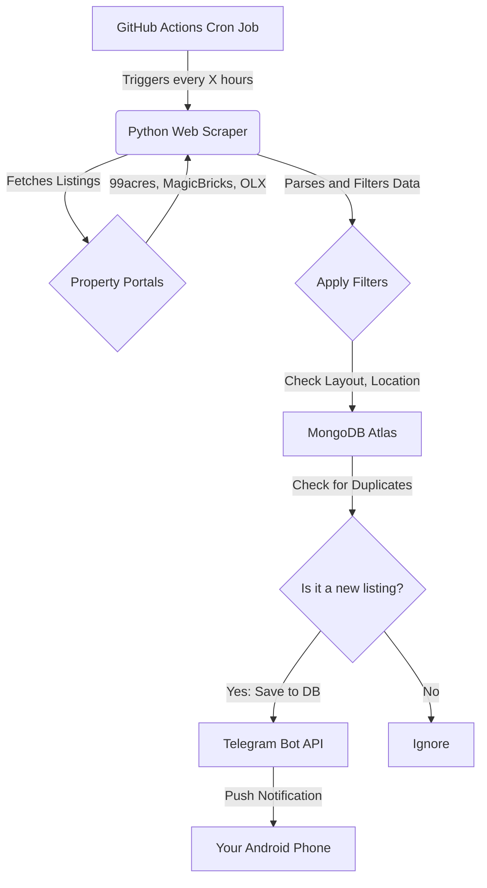

# Personal Property Watcher: Architecture and Implementation Guide

## 1. Project Overview
Build a personalized automated system to monitor real estate listings across multiple property portals. The system scrapes configured areas, filters by specific preferences, deduplicates entries, and sends instant push notifications to a mobile device.

### Primary Tech Stack
- Backend and scraper: Python
- Database: MongoDB Atlas (free tier)
- Task scheduling: GitHub Actions (cron jobs)
- Delivery and notifications: Telegram Bot API

---

## 2. System Architecture



## 3. Component Details and Implementation

### Phase 1: Python Scraper (The Engine)
The core script fetches listing data. Since target sites may have anti-scraping measures, use `BeautifulSoup` for static pages and `Selenium` or `Playwright` for dynamic pages.

### Filtering Logic
Configure strict, local-context filters such as:
- Locations: Trivandrum, Manacaud, Attukal Temple
- Keywords: vastu compliant, east facing, puja room, unfurnished 2BHK

### Conceptual Python Snippet
```python
import requests
from bs4 import BeautifulSoup
import pymongo

# MongoDB setup
client = pymongo.MongoClient("YOUR_MONGODB_URI")
db = client.property_watcher
collection = db.listings

def scrape_properties():
    # Example URL (replace with actual search URL)
    url = "https://example-real-estate-site.com/search"
    headers = {"User-Agent": "Mozilla/5.0..."}

    response = requests.get(url, headers=headers, timeout=30)
    response.raise_for_status()
    soup = BeautifulSoup(response.text, "html.parser")

    for item in soup.find_all("div", class_="property-card"):
        property_id = item.get("data-id")
        title = item.find("h2").text.strip()
        price = item.find("span", class_="price").text.strip()
        description = item.find("p", class_="desc").text.lower()
        link = item.find("a")["href"]

        # Apply strict filters
        if "vastu" in description or "east facing" in description:
            # Check MongoDB for duplicates
            if not collection.find_one({"property_id": property_id}):
                listing_data = {
                    "property_id": property_id,
                    "title": title,
                    "price": price,
                    "link": link,
                }
                collection.insert_one(listing_data)
                send_telegram_alert(listing_data)
```

### Phase 2: Database Storage (MongoDB Atlas)
Use MongoDB Atlas (M0 free cluster) to store historical data.

Benefits:
- Deduplication: avoid duplicate alerts for the same property.
- Price tracking: detect changes for existing `property_id` values.

Schema example:
```json
{
  "_id": "60d5ec49f1b2c8...",
  "property_id": "99A-102938",
  "source": "99acres",
  "title": "2 BHK Unfurnished Apartment in Manacaud",
  "price": "4500000",
  "currency": "INR",
  "url": "https://...",
  "discovered_at": "2026-05-12T07:00:00Z"
}
```

### Phase 3: Automation (GitHub Actions)
Deploy the scraper to a private GitHub repository and run it on schedule.

Workflow file: `.github/workflows/scraper.yml`

```yaml
name: Property Scraper Automation

on:
  schedule:
    # Runs every 4 hours
    - cron: "0 */4 * * *"
  workflow_dispatch:

jobs:
  scrape:
    runs-on: ubuntu-latest
    steps:
      - name: Checkout repository
        uses: actions/checkout@v4

      - name: Setup Python
        uses: actions/setup-python@v5
        with:
          python-version: "3.10"

      - name: Install dependencies
        run: pip install -r requirements.txt

      - name: Run scraper
        env:
          MONGO_URI: ${{ secrets.MONGO_URI }}
          TELEGRAM_BOT_TOKEN: ${{ secrets.TELEGRAM_BOT_TOKEN }}
          TELEGRAM_CHAT_ID: ${{ secrets.TELEGRAM_CHAT_ID }}
        run: python scraper.py
```

### Phase 4: Delivery System (Telegram)
Telegram bot notifications are instant and reliable, and they avoid building a separate mobile app.

Setup:
- Message `@BotFather` in Telegram to create a bot and get a token.
- Retrieve your personal `chat_id`.
- Add an alert function to your Python script.

```python
def send_telegram_alert(listing):
    token = "YOUR_BOT_TOKEN"
    chat_id = "YOUR_CHAT_ID"
    message = (
        f"New Property Match!\n\n"
        f"{listing['title']}\n"
        f"Price: {listing['price']}\n"
        f"View Listing: {listing['link']}"
    )

    url = f"https://api.telegram.org/bot{token}/sendMessage"
    payload = {"chat_id": chat_id, "text": message}
    requests.post(url, json=payload, timeout=20)
```

## 4. Deployment Checklist
- [ ] Create a private GitHub repository.
- [ ] Write and test `scraper.py` locally.
- [ ] Set up a free MongoDB Atlas cluster and allow GitHub Actions IP access as required.
- [ ] Create a Telegram bot and retrieve credentials.
- [ ] Add `MONGO_URI`, `TELEGRAM_BOT_TOKEN`, and `TELEGRAM_CHAT_ID` to GitHub repository secrets.
- [ ] Push `.github/workflows/scraper.yml` to enable automation.